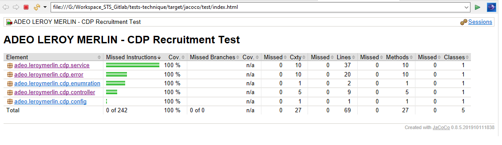

# Event Management REST API 

`My Event` is an application to manage musical events (_**ADEO Services technical tests**_).
`My Event` is simple RESTful web service using Spring and Java. 
This web service provides an in-memory musical events management **Back-End** service, with the capability to :
- Get a list of musical events and their relationships in the system.
- Delete a musical events and their relationships in the system.
- Update musical events information in the system.
- Get a filtered list (one band has a member with the name matching the given pattern) of musical events.
- Find a musical events by her technical identifier.
- Save or persist a musical events information .

For the Front-end, the user interface allows to :
- Displaying  a list of musical events. 
- Deleting a musical events.
- Updating musical events information.


## Technical stack


- This is a maven project.
- It uses HSQLDB as an in-memory database.
- It uses Angular JS for Front-End user interface.
- It uses JPA/Hibernate for ORM and DAO concepts.

### Change Event Management configuration
Edit the configuration in the file [application.yml](/tests-technique/src/main/resources/application.yml)
```yml
# App custom config
server:
  port: 8086
# Database Configuration
spring:
  datasource:
    driverClassName: org.hsqldb.jdbc.JDBCDriver
    platform: hsql
    url: jdbc:hsqldb:mem:eventdb;DB_CLOSE_DELAY=-1 
    username: sa
    password: ""
  jpa:
    database: hsql
    showSql: true # only in developement mode, not in prod.
    hibernate:
      ddlAuto: ""
    properties: 
      hibernate.format_sql: true # only in developement mode, not in prod.
# Logger configuration
logging:
  config: classpath:logback-spring.xml
```
### Starting the Event Management System

- It starts using this maven lifecycle ``` mvn spring-boot:run``` or using the IDE
- The user interface is available at : _http://localhost:${server.port}_
- The API resources are available at : _http://localhost:${server.port}/api/_ 


## REST Endpoints
The following REST endpoints are available upon deployment of the event management system :

|HTTP Verb|URL|Description|Status Codes|
|---|---|---|---|
|`GET`|_http://localhost:${server.port}/api/events/_|Obtains a list of all existing musical events|`200 OK`|
|`GET`|_http://localhost:${server.port}/api/events/search/{query}_|Obtains event filtered list to display|<ul><li>`200 OK` if event exists</li><li>`empty list or other` if the event does not exist</li></ul>|
|`DELETE`|_http://localhost:${server.port}/api/events/{id}_|Deletes an existing event that corresponds to Id|<ul><li>`200 OK` if the event was successfully deleted</li><li>`500 Internal Server Error` if the event does not exist</li></ul>|
|`PUT`|_http://localhost:${server.port}/api/events/{id}_|Updated an existing event with the data contained in the request body|<ul><li>`200 OK` if the event was successfully updated</li><li>`400 Bad Request` with null event or not exist Id</li><li>`405 Method Not Allowed` with null query pattern</li></ul> 


## Issues Analysis :

_1. Adding review does not work_
- No entry point for the user interface to trigger the update action.
- In the controller the called function for updating is empty.
- In the service and DAO layers, no functions either to search for it by identifier or to save (persistence or update) data.
- No cascaded persistence propagation defined in associations (model layer).
- The transaction is readOnly activate (can't write, update, delete).

_2. Using the delete button works but elements comes back when i refresh the page_ 
- The transaction is readOnly activate (can't write, update, delete).
- The suppress operation not really done in database.


## Issues Solutions Elements :

_1. Adding review does not work_
- Adding new component on the user interface to triggering the update action.
- In model layer activate cascaded propagation in associations for data persistence ou update.
- DAO layer : 
	- remove transaction readOnly activation.
	- use readOnly default.
	- adding new function to retrieve by her identifier a musical event with bands.
	- adding new function to save a musical event with bands.
- Service layer : integrated DAO layer functions. 
- Realize Tests for all components (Unit, Integration, Functional Tests).

_2. Using the delete button works but elements comes back when i refresh the page_ 
- remove transaction readOnly activation.
- use readOnly default.


## New Feature
```
No library/modules not added to the dependencies, except for the testing libraries(only pure java use)
```

1. Enable a new route for the API `/search/{query}`. 
- get filtered `events`.
- get filtered `events` only if at least one band has a member with the name matching the given pattern.

Example: `/search/Wa`
```json
[{
    "title": "GrasPop Metal Meeting",
    "imgUrl": "img/1000.jpeg",
    "bands": [{
        "name": "Metallica",
        "members": [
            {
              "name": "Queen Anika Walsh"
            }
        ]
    },…
}…]
```

2. (BONUS) Add a `[count]` at each event and band 
to display the number of child items.

Example: `/search/Wa`
```json
[{
    "title": "GrasPop Metal Meeting [2]",
    "imgUrl": "img/1000.jpeg",
    "bands": [{
        "name": "Metallica [1]",
        "members": [
            {
              "name": "Queen Anika Walsh"
            }
        ]
    },…
}…]
```

## Testing
Classic Java Spring tests tools are using to do tests.

### Type of Tests
- _Unit Tests_
- _Integration Tests_
- _Functional Tests_

### Tests Tools
- Spring Framework Tests tools (_spring-boot-starter-test_) which embedded :
	- _spring-test, spring-boot-test, spring-boot-test-autoconfigure_
	- _JUnit 4_
	- _Mockito_
	- _Assertions with Assert-J_,…
- JaCoCo maven plugin (with surefire and failsafe plugin) to produce the code coverage report.
- Postman for testing API

### Tests Coverage Report
Test coverage is measured and provided by JaCoCo. The image below provides app's code coverage with the exception of model layer objects.

